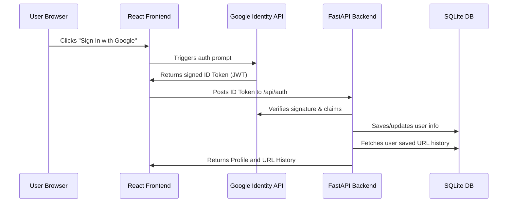

# WebPage RAG Chat Assistant 🤖

WebPage RAG Chat is a modern, high-fidelity conversational AI application that allows you to load any webpage, index its text contents using LangChain, and chat with it in real-time. It uses an advanced Retrieval-Augmented Generation (RAG) architecture powered by OpenAI models and stores user history persistently.

---

## 🛠️ Technology Stack

* **Frontend**: Single Page React Application (delivered via CDN), using Babel for in-browser JSX compilation. Styled with high-fidelity glassmorphism, responsive grid layouts, custom dark mode, and Outfit Google Fonts.
* **Backend**: FastAPI (Python) web server serving endpoints for authentication, context indexing, and query pipelines.
* **RAG Framework**: LangChain (Document Loaders, Recursive text splitters, Retrieval chains).
* **Vector Store**: Chroma DB (in-memory embedded vector store).
* **Database**: SQLite (built-in relational database) to store user sessions and chat logs persistently.
* **Authentication**: Google Identity Services (Google Sign-In OAuth 2.0) with developer-bypass credentials for local testing.

---

## 📂 Project Directory Structure

The project code is organized modularly to decouple backend and frontend concerns:

```
WebPage-RAG-Chat-Simple-searchable-and-tells-users-exactly-what-it-is/
├── backend/
│   ├── app.py             # FastAPI backend routing and API setup
│   ├── db.py              # Database initialization and SQLite CRUD helpers
│   ├── auth.py            # Google OAuth token verification and developer mode
│   ├── rag.py             # LangChain document loaders & QA retrieval chains
│   └── requirements.txt   # Backend Python dependency list (no Streamlit)
├── frontend/
│   ├── index.html         # Web client entry point
│   ├── styles.css         # Visual styles and animations
│   └── src/
│       ├── App.js         # Main React parent App component
│       └── components/
│           ├── AuthOverlay.js # Google Sign-In & Mock login overlay
│           ├── Sidebar.js     # Settings, history listing & profile bar
│           └── ChatArea.js    # Chat log layout and messaging input
├── .env                   # Shared configuration & API keys
├── .gitignore             # Git ignore patterns (venv, .env, DB, caches)
└── rag_chat.db            # SQLite database file (created automatically)
```

---

## 🔑 Google Sign-In & Auth Flow

The login system validates the user identity through Google OAuth 2.0.



### Setup Google Client ID (Free)

1. Open the [Google Cloud Console Credentials Page](https://console.cloud.google.com/apis/credentials).
2. Select or create a project.
3. Click **Create Credentials** -> **OAuth Client ID**.
4. Choose **Web Application** as the application type.
5. In **Authorized JavaScript origins**, click **+ ADD URI** and add:
   * `http://localhost:8000`
   * `http://127.0.0.1:8000`
6. Click **Save** and copy the generated **Client ID**.
7. Open `.env` and add:
   ```env
   GOOGLE_CLIENT_ID=your_client_id_here.apps.googleusercontent.com
   ```

*(If you leave `GOOGLE_CLIENT_ID` empty, the app will run in **Developer Mode**, allowing you to log in with a mock developer username instantly for local testing).*

---

## 🚀 How to Run the Project

### 1. Configure Environment Variables
Make sure your `.env` contains:
```env
OPENAI_API_KEY=your_openai_api_key
GOOGLE_CLIENT_ID=your_google_client_id  # optional
```

### 2. Set Up Virtual Environment & Install Dependencies
Run the following in your terminal:
```bash
# Initialize and activate Python virtual environment
python3 -m venv venv
source venv/bin/activate

# Install requirements
pip install -r backend/requirements.txt
```

### 3. Launch Backend & Frontend Server
Run the FastAPI backend with:
```bash
uvicorn backend.app:app --reload
```

Open your browser and navigate to:
👉 **[http://127.0.0.1:8000/](http://127.0.0.1:8000/)**
